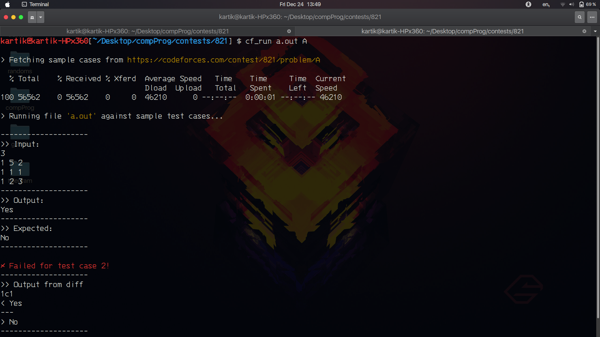

# CP Scripts
I am trying to learn bash scripting and the same time try to use it for the purpose of speeding up my competitive programming experience. For that I will be creating several scripts. 
For now its only `cf_run` script which runs sample test cases taken from problem page on Codeforces and run it against your program output file and tells how many of the sample test cases passed.
> I am newbie at bash scripting, so I apparently was not able to catch all the errors and also the code might consist of some extra useless code.

| Script | Function |
|--------|----------|
|[cf_run](#cf_run) | Runs the sample test cases and shows the status of output for **Codeforces** contests|

## Usage 
The scripts have been tested for **Ubuntu 20.04** *(If the script works on your device as well, feel free to add it here!)*. You can follow this given steps to get the things working.

1. Clone this repository using `git clone` command.
2. Make sure all the scripts are executable, if not you can make them executable using `chmod +x script-name` command.
3. Add this directory to your `PATH`, so that you can use it from anywhere.
4. Follow the respective steps for each directory.

### cf_run
This script will run you program against the sample test cases present on problem page on **Codeforces**, so the name **cf_run**.
For this to work you need to make sure following things - 
* You need to create a directory for the contest you are participating in. Let's say you are participating in contest `1619`, then you have to create a directory with the same name, you can use this command `mkdir 1619 && cd 1619`.
* Let's say for problem statement `A`, you create a file called `a.cpp` and compile it. Let's say compiled file has a name `a.out`.
* Then to run your file, you will use the command `cf_run a.out A`, which basically runs sample test cases for problem statement `A` against `a.out` file.

**Working:** It takes `contest_id` from the name of your directory *(here 1619)*, then using this id and second argument of the command *(i.e. problem_code, here A)*, it scrapes the webpage `https://codeforces.com/contest/1619/problem/A`.

**Screenshots**

